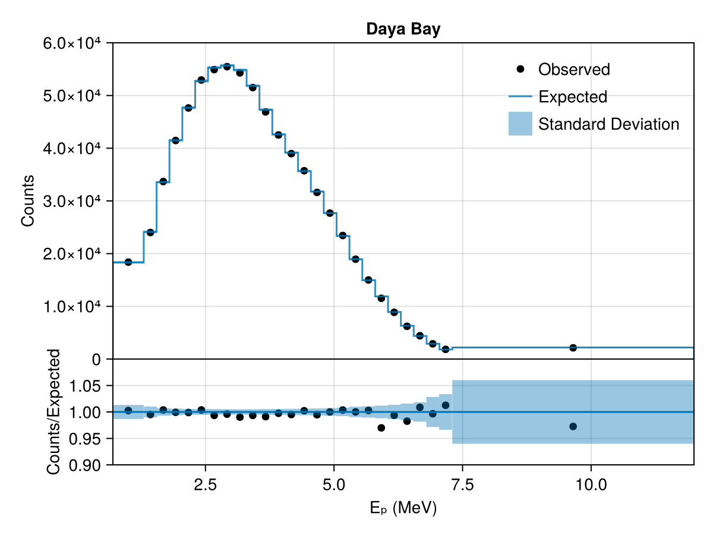
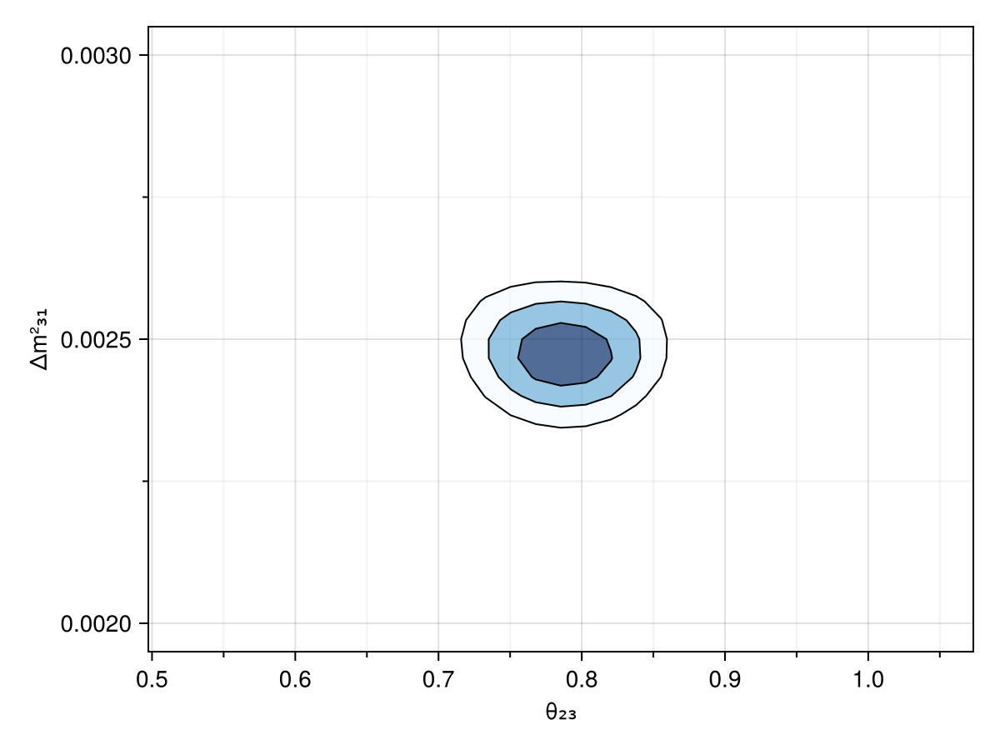

# Newtrinos.jl

**Newtrinos.jl** is a Julia package for the **global analysis of neutrino data**.

## Overview

The package is built to support flexible and modular analysis of neutrino physics, combining experimental data with theoretical models and inference tools.

## Code Structure

Newtrinos.jl is organized into three core components:

- **Experimental Likelihoods** (`src/experiments`):  
  Modules for various neutrino experiments and datasets, each encapsulating experiment-specific behavior.

- **Physics Modules** (`src/physics`):  
  Functions and tools for computing neutrino oscillation probabilities, atmospheric fluxes, and other theoretical predictions.

- **Analysis Tools** (`src/analysis`):  
  Interfaces for running inference — both **Frequentist** and **Bayesian** — using experimental and theoretical models.

## Design Philosophy

The codebase follows a **modular** and **orthogonal** architecture:

- **Experiments** only depend on their specific setup and data; they do **not** contain any theory or inference logic.
- **Physics** modules focus solely on theoretical modeling; they are unaware of experiments or statistical methods.
- **Inference** tools treat experiments and theory modules as interchangeable black boxes — allowing flexible composition.

This separation is enforced through consistent interfaces and data structures.

## Module Conventions

To ensure interoperability, each module (experimental or theoretical) should follow these conventions:

- Define all model parameters and priors using **`NamedTuple`s**.
- Experimental modules should implement the following functions:

  ```julia
  configure(config::NamedTuple)     # Configure the experiment with physics modules
  setup()                            # Initialize experiment internals
  get_forward_model()               # Return a callable model for likelihood evaluation
  plot(params::NamedTuple)          # (Optional) Visualize data or model output
  ```

Here, `config` is a `NamedTuple` containing any required physics module dependencies.

## Example Lieklihood

This section shows an example how to set up a joint likelihood.


```julia
using Newtrinos
```

Here we choose four experimental likelihoods:


```julia
exp_modules = (;Newtrinos.deepcore, Newtrinos.minos, Newtrinos.dayabay, Newtrinos.kamland)
```


    (deepcore = Newtrinos.deepcore, minos = Newtrinos.minos, dayabay = Newtrinos.dayabay, kamland = Newtrinos.kamland)


Then we specify three physics modules in our config, where we decided on a module for standard 3-flavour oscillations, and modules for computing atmospheric fluxes and Earth density profiles:


```julia
config = (
    osc = Newtrinos.osc.standard,
    atm_flux = Newtrinos.atm_flux,
    earth_layers = Newtrinos.earth_layers
)
```


    (osc = Newtrinos.osc.standard, atm_flux = Newtrinos.atm_flux, earth_layers = Newtrinos.earth_layers)


The experimental likelihoods now need to be configured with the physics. here we use the same config for all modules, and each module grabs whatever it needs from that config.


```julia
[m.configure(;config...) for m in exp_modules];
```

Then the setup function should be called once for each module, which will cause the module to load its data into `module.assets`


```julia
[m.setup() for m in exp_modules];
```

    [ Info: Loading deepcore data
    [ Info: Loading minos data
    [ Info: Loading dayabay data
    [ Info: Loading kamland data


This is enough to generate a joint likelihood for everything:


```julia
likelihood = Newtrinos.generate_likelihood(exp_modules);
```

Let's evaluate the likelihood! For this we also need parameter values. The following function goeas through both. experimental and theory modules and collects all parameters:


```julia
p = Newtrinos.get_params(exp_modules)
```


    (atm_flux_delta_spectral_index = 0.0, atm_flux_nuenumu_sigma = 0.0, atm_flux_nunubar_sigma = 0.0, atm_flux_uphorizonzal_sigma = 0.0, deepcore_atm_muon_scale = 1.0, deepcore_ice_absorption = 1.0, deepcore_ice_scattering = 1.0, deepcore_lifetime = 2.5, deepcore_opt_eff_headon = 0.0, deepcore_opt_eff_lateral = 0.0, deepcore_opt_eff_overall = 1.0, kamland_energy_scale = 0.0, kamland_flux_scale = 0.0, kamland_geonu_scale = 0.0, nc_norm = 1.0, nutau_cc_norm = 1.0, Δm²₂₁ = 7.53e-5, Δm²₃₁ = 0.0024752999999999997, δCP = 1.0, θ₁₂ = 0.5872523687443223, θ₁₃ = 0.1454258194533693, θ₂₃ = 0.8556288707523761)


```julia
using DensityInterface
```


```julia
@time logdensityof(likelihood, p)
```

      0.042326 seconds (49.10 k allocations: 76.227 MiB, 17.94% gc time)


    -1080.6543117055216


If the likelihood defines a plotting function, we can make convenient plots:


```julia
img = exp_modules.dayabay.plot(p)
display("image/png", img)
```


    

    


## Automatic Differentiation

For efficient inference, it is important to have access to gradients. therefore all code is fully differentiable via auto-diff, using the ForwardDiff package:


```julia
using ForwardDiff
```


```julia
ForwardDiff.gradient(p -> logdensityof(likelihood, p), p)
```


    (atm_flux_delta_spectral_index = 262.8120902081794, atm_flux_nuenumu_sigma = -0.6494110485544047, atm_flux_nunubar_sigma = -3.7454697695197274, atm_flux_uphorizonzal_sigma = 1.5904384931010436, deepcore_atm_muon_scale = -1.1612509099067818, deepcore_ice_absorption = 23.215534562299336, deepcore_ice_scattering = 309.74179980457177, deepcore_lifetime = -191.94268496042022, deepcore_opt_eff_headon = -33.947486872831675, deepcore_opt_eff_lateral = 40.41140595498514, deepcore_opt_eff_overall = -257.1048344886879, kamland_energy_scale = -1.3322233658320863, kamland_flux_scale = 1.1102273782788554, kamland_geonu_scale = 1.3338116809640645, nc_norm = -25.46398416438826, nutau_cc_norm = -59.46669650099511, Δm²₂₁ = 687419.0875551306, Δm²₃₁ = 15034.795584326293, δCP = -0.35888949190589636, θ₁₂ = -19.102454876163787, θ₁₃ = 420.73886060499507, θ₂₃ = -170.30277734032427)


## Inference

Let's run a likelihood analysis to construct confidence contours in the (θ₂₃, Δm²₃₁) parameter space.
Here we use a conditional likelihood for illusatration. More realistically, you may want to run `Newtrinos.profile` instead for a full profile likelihood.
Examples on Bayesian Inference will follow.


```julia
result = Newtrinos.scan(likelihood, Newtrinos.get_priors(exp_modules), (θ₂₃=31, Δm²₃₁=31), p)
```


    NewtrinosResult((θ₂₃ = [0.5235987755982988, 0.5410520681182421, 0.5585053606381853, 0.5759586531581287, 0.593411945678072, 0.6108652381980153, 0.6283185307179586, 0.6457718232379018, 0.6632251157578452, 0.6806784082777885  …  0.890117918517108, 0.9075712110370513, 0.9250245035569946, 0.9424777960769379, 0.9599310885968813, 0.9773843811168245, 0.9948376736367678, 1.012290966156711, 1.0297442586766543, 1.0471975511965976], Δm²₃₁ = [0.002, 0.002033333333333333, 0.0020666666666666667, 0.0021, 0.0021333333333333334, 0.0021666666666666666, 0.0022, 0.0022333333333333333, 0.002266666666666667, 0.0023  …  0.0027, 0.0027333333333333333, 0.002766666666666667, 0.0028, 0.0028333333333333335, 0.0028666666666666667, 0.0029000000000000002, 0.0029333333333333334, 0.002966666666666667, 0.003]), (atm_flux_delta_spectral_index = [0.0 0.0 … 0.0 0.0; 0.0 0.0 … 0.0 0.0; … ; 0.0 0.0 … 0.0 0.0; 0.0 0.0 … 0.0 0.0], atm_flux_nuenumu_sigma = [0.0 0.0 … 0.0 0.0; 0.0 0.0 … 0.0 0.0; … ; 0.0 0.0 … 0.0 0.0; 0.0 0.0 … 0.0 0.0], atm_flux_nunubar_sigma = [0.0 0.0 … 0.0 0.0; 0.0 0.0 … 0.0 0.0; … ; 0.0 0.0 … 0.0 0.0; 0.0 0.0 … 0.0 0.0], atm_flux_uphorizonzal_sigma = [0.0 0.0 … 0.0 0.0; 0.0 0.0 … 0.0 0.0; … ; 0.0 0.0 … 0.0 0.0; 0.0 0.0 … 0.0 0.0], deepcore_atm_muon_scale = [1.0 1.0 … 1.0 1.0; 1.0 1.0 … 1.0 1.0; … ; 1.0 1.0 … 1.0 1.0; 1.0 1.0 … 1.0 1.0], deepcore_ice_absorption = [1.0 1.0 … 1.0 1.0; 1.0 1.0 … 1.0 1.0; … ; 1.0 1.0 … 1.0 1.0; 1.0 1.0 … 1.0 1.0], deepcore_ice_scattering = [1.0 1.0 … 1.0 1.0; 1.0 1.0 … 1.0 1.0; … ; 1.0 1.0 … 1.0 1.0; 1.0 1.0 … 1.0 1.0], deepcore_lifetime = [2.5 2.5 … 2.5 2.5; 2.5 2.5 … 2.5 2.5; … ; 2.5 2.5 … 2.5 2.5; 2.5 2.5 … 2.5 2.5], deepcore_opt_eff_headon = [0.0 0.0 … 0.0 0.0; 0.0 0.0 … 0.0 0.0; … ; 0.0 0.0 … 0.0 0.0; 0.0 0.0 … 0.0 0.0], deepcore_opt_eff_lateral = [0.0 0.0 … 0.0 0.0; 0.0 0.0 … 0.0 0.0; … ; 0.0 0.0 … 0.0 0.0; 0.0 0.0 … 0.0 0.0], deepcore_opt_eff_overall = [1.0 1.0 … 1.0 1.0; 1.0 1.0 … 1.0 1.0; … ; 1.0 1.0 … 1.0 1.0; 1.0 1.0 … 1.0 1.0], kamland_energy_scale = [0.0 0.0 … 0.0 0.0; 0.0 0.0 … 0.0 0.0; … ; 0.0 0.0 … 0.0 0.0; 0.0 0.0 … 0.0 0.0], kamland_flux_scale = [0.0 0.0 … 0.0 0.0; 0.0 0.0 … 0.0 0.0; … ; 0.0 0.0 … 0.0 0.0; 0.0 0.0 … 0.0 0.0], kamland_geonu_scale = [0.0 0.0 … 0.0 0.0; 0.0 0.0 … 0.0 0.0; … ; 0.0 0.0 … 0.0 0.0; 0.0 0.0 … 0.0 0.0], nc_norm = [1.0 1.0 … 1.0 1.0; 1.0 1.0 … 1.0 1.0; … ; 1.0 1.0 … 1.0 1.0; 1.0 1.0 … 1.0 1.0], nutau_cc_norm = [1.0 1.0 … 1.0 1.0; 1.0 1.0 … 1.0 1.0; … ; 1.0 1.0 … 1.0 1.0; 1.0 1.0 … 1.0 1.0], Δm²₂₁ = [7.53e-5 7.53e-5 … 7.53e-5 7.53e-5; 7.53e-5 7.53e-5 … 7.53e-5 7.53e-5; … ; 7.53e-5 7.53e-5 … 7.53e-5 7.53e-5; 7.53e-5 7.53e-5 … 7.53e-5 7.53e-5], δCP = [1.0 1.0 … 1.0 1.0; 1.0 1.0 … 1.0 1.0; … ; 1.0 1.0 … 1.0 1.0; 1.0 1.0 … 1.0 1.0], θ₁₂ = [0.5872523687443223 0.5872523687443223 … 0.5872523687443223 0.5872523687443223; 0.5872523687443223 0.5872523687443223 … 0.5872523687443223 0.5872523687443223; … ; 0.5872523687443223 0.5872523687443223 … 0.5872523687443223 0.5872523687443223; 0.5872523687443223 0.5872523687443223 … 0.5872523687443223 0.5872523687443223], θ₁₃ = [0.1454258194533693 0.1454258194533693 … 0.1454258194533693 0.1454258194533693; 0.1454258194533693 0.1454258194533693 … 0.1454258194533693 0.1454258194533693; … ; 0.1454258194533693 0.1454258194533693 … 0.1454258194533693 0.1454258194533693; 0.1454258194533693 0.1454258194533693 … 0.1454258194533693 0.1454258194533693], llh = Any[-1348.6158199397485 -1339.0255109952664 … -1275.1042006941097 -1280.5279671478045; -1316.3006043434361 -1306.6398895425582 … -1247.7209271609552 -1253.6304998292287; … ; -1306.1765842335155 -1296.4484984058943 … -1242.8071961739386 -1249.27160046309; -1337.5934227086098 -1327.9283708363505 … -1268.584244242452 -1274.5095917508493], log_posterior = Any[-1348.6158199397485 -1339.0255109952664 … -1275.1042006941097 -1280.5279671478045; -1316.3006043434361 -1306.6398895425582 … -1247.7209271609552 -1253.6304998292287; … ; -1306.1765842335155 -1296.4484984058943 … -1242.8071961739386 -1249.27160046309; -1337.5934227086098 -1327.9283708363505 … -1268.584244242452 -1274.5095917508493]))


```julia
using CairoMakie
```


```julia
img = plot(result)
display("image/png", img)
```


    

    


```julia

```
