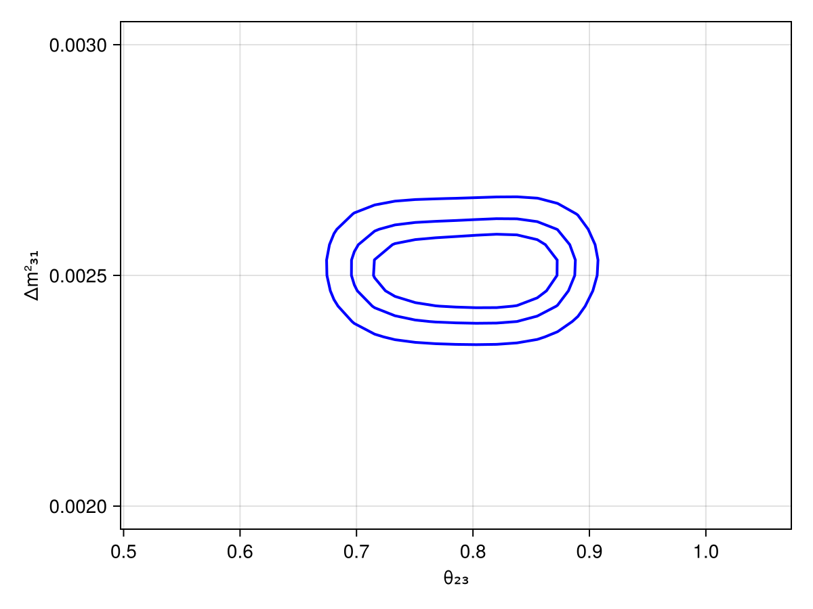

<!--- badges of CI, coverage, license, docs(missing)-->
[](https://github.com/davschu/Newtrinos.jl/actions/workflows/CI.yml)
[](https://codecov.io/github/davschu/Newtrinos.jl)
[](https://opensource.org/licenses/MIT)
[](https://pilippeller.github.io/Newtrinos.jl/dev/)

# Newtrinos.jl

**Newtrinos.jl** is a Julia package for the **global analysis of neutrino data**, fully open source and free to use under the MIT license.

## Overview

The package is built to support flexible and modular analysis of neutrino physics, combining experimental data with physics models and inference tools. It provides a modular, three-layer architecture that separates physics models, experiment descriptions, and statistical inference into independent modules. This allows researchers to freely combine experiments and test them against a variety of theoretical models. New experiments and physics models can be added without modifying core code. Full statistical forward models including all relevant systematic uncertainties are implemented for each experimental dataset, defining both the likelihood and the data-generating process and enabling modern statistical inference workflows. The framework is composable, making it straightforward to construct joint likelihoods over multiple datasets. Physics and nuisance parameters can be merged, correlated, or decorrelated across experiments to ensure consistency in the joint fit. The package supports Frequentist and Bayesian inference and is parallelizable across CPU threads or distributed workers. Written entirely in Julia, all models are automatically differentiable, enabling exact gradient computation.

## Code Structure

Newtrinos.jl follows a **modular** and **orthogonal** architecture organized into three layers:

- **Experimental Likelihoods** (`src/experiments`):  
  Modules for various neutrino experiments and datasets, each encapsulating experiment-specific behavior. The experiments only depend on their specific setup and data; they do **not** contain any theory or inference logic.

- **Physics Modules** (`src/physics`):  
  Functions and tools for computing physics, such as neutrino oscillation probabilities, atmospheric fluxes, and other theoretical predictions. The physics models focus solely on theoretical modeling; they are unaware of experiments or statistical methods.

- **Analysis Tools** (`src/analysis`):  
  Interfaces for running inference — both **Frequentist** and **Bayesian** — using experimental and theoretical models. The inference tools treat experiments and theory modules as interchangeable black boxes — allowing flexible composition.

This separation is enforced through consistent interfaces and data structures.

## Module Conventions
The layers communicate through two well-defined interfaces: NamedTuples of parameters and priors adhering to the Distributions.jl standard, and callable functions stored in structs. To ensure interoperability, each module (experimental or theoretical) should follow these conventions:

- Physics Modules should upon configuration return a struct of abstract type Newtrinos.Physics that contains at least named tuples for the params and priors of the model. In addition the struct can provide some functionality to be used by experiments, for instance some model specific functions.
```julia
params::NamedTuple          # Nominal values of the parameters concerning the module
priors::NamedTuple          # Priors (Distributions) for the parameters of the module
functionality::Function     # additional functionality of the model 
```
  
- Experiments should return a struct of abstract type Newtrinos.Experiment that contains the following:
```julia
physics::NamedTuple     # The configured physics module structs for that module
params::NamedTuple      # Nominal values of the parameters concerning the module
priors::NamedTuple      # Priors (Distributions) for the parameters of the module
assets::NamedTuple      # all (meta)data the module needs, such as MC and other data.
                        # This NamedTuple is also expected to have a field `observed` that contains the observed data
forward_model::Function # A callable model for likelihood evaluation
plot::Function          # (Optional) Visualize data or model output
```

## Installation
Newtrinos.jl is not yet registered in the Julia General registry, so it must be installed directly from GitHub.
Open a Julia session by running `julia` in your terminal (or launching the Julia application), then run:

```julia
using Pkg
Pkg.add(url="https://github.com/philippeller/Newtrinos.jl.git")
```

Julia will download the package and all its dependencies automatically.
After installation, load Newtrinos.jl at the start of any Julia session:

```julia
using Newtrinos
```

## Quick example
This section shows a brief example as entry point. For more detailed tutorials or more complex and specific examples, have a look at the [documentation](https://philippeller.github.io/Newtrinos.jl/dev/).
For this example, we want to set up a joint likelihood for the IceCube deepcore and DayaBay experiment, find the maximum likelihood estimator (MLE) for the default 3-flavour neutrino oscillation model, and do a conditional likelihood scan for $\theta_{23}$ and $\Delta m^2_{13}$.

At first, we have to load the package:

```julia
using Newtrinos
```
Now, we usually specify the physics model as described [here](https://philippeller.github.io/Newtrinos.jl/dev/tutorials/physics_model/). But since we're using the default physics model, we can skip this and configure the experiments directly via the `configure` method of each experiment. 

```julia
experiments = (
    deepcore = Newtrinos.deepcore.configure(),
    dayabay  = Newtrinos.dayabay.configure(),
)
```

`configure` basically collects the physical and experimental parameters and priors and also sets up the respective forward model.

The joint parameters and priors can be collected with `get_params` and `get_priors`:
```julia
params = Newtrinos.get_params(experiments)
priors = Newtrinos.get_priors(experiments)
```
This yields two named tuples that contain all physical and systematic parameters and their priors. The parameters and priors can be modified as needed, e.g. for likelihood conditioning via Accessors.jl.
With the experiments configured, we can generate a joint likelihood function via:

```julia
likelihood=Newtrinos.generate_likelihood(experiments)
```

Now we have everything that we need to find the MLE with the `find_mle` method. 


```julia
#combine the priors into a product of prior distributions
using BAT #need BAT.jl for the distprod function
priors_d = distprod(;priors...)

#find MLE
llh, log_posterior, mle_result = Newtrinos.find_mle(likelihood, priors_d, params)
```
    (-707.2266316049163, -691.3791855711287, (atm_flux_delta_spectral_index = -0.011500623620874055, atm_flux_nuenuebar_sigma = 0.42514068413367867, atm_flux_nuenumu_sigma = -0.29854694769791634, atm_flux_numunumubar_sigma = 0.11752534209282282, atm_flux_updown_sigma = -0.011640814282917968, atm_flux_uphorizonzal_sigma = 1.3893974734528725, deepcore_atm_muon_scale = 0.9521734663815058, deepcore_ice_absorption = 1.017162388562784, deepcore_ice_scattering = 0.9743905033077925, deepcore_lifetime = 2.2950629516698573, deepcore_opt_eff_headon = -1.646207102035849, deepcore_opt_eff_lateral = -0.16223412929881892, deepcore_opt_eff_overall = 1.0285859873759597, nc_norm = 1.273987665177003, nutau_cc_norm = 0.9129894342710065, Δm²₂₁ = 8.996846429225628e-5, Δm²₃₁ = 0.0025099423411991256, δCP = 0.00036950742426112925, θ₁₂ = 0.4205343352839651, θ₁₃ = 0.14885419620462434, θ₂₃ = 0.8177926161580809))

Great! Now we have the combined MLE for the combined experiments. The result contains the log-likelihood, log-posterior, and values of all parameters at the MLE. This might take a few minutes if you run it by yourself, because we are optimizing the likelihood over 21 free parameters. In the mean time you could take a look at the [documentation](https://philippeller.github.io/Newtrinos.jl/dev/) and read how to use multithreading or distributed workers for handling larger analyses. 

We can also run a likelihood analysis to construct confidence contours in the (θ₂₃, Δm²₃₁) parameter space. Here we use a conditional likelihood scan that scans the likelihood values at the (θ₂₃ x Δm²₃₁) grid points. More realistically, you may want to run `Newtrinos.profile` instead for a full profile likelihood.

```julia
result = Newtrinos.scan(likelihood, priors, (θ₂₃=31, Δm²₃₁=31), mle_result)
```
```julia
using CairoMakie
fig = Figure()
ax = Axis(fig[1, 1], xlabel="θ₂₃", ylabel="Δm²₃₁")
plot!(ax, result, levels=[0, 0.68, 0.9, 0.99]) # 68%, 90%, and 99% CL 
fig
```



## Further Reading / Examples

You can find tutorials and more examples in the [documentation](https://philippeller.github.io/Newtrinos.jl/dev/). You can also look inside the subdirectories of the various experimental datasets under `src/experiments/x/y`. Each of these subdirectories contains a julia script `test.jl` that is aimed at reproducing official results.

## Contributing to Newtrinos.jl
All contributions, bug reports, bug fixes, documentation improvements, enhancements, and ideas are welcome. If you want to contribute, please take a look at the [contribution guidelines](https://philippeller.github.io/Newtrinos.jl/dev/contribution_guidelines/).

## References

Newtrinos has been used to produce the results presented in:
* [Testing the number of neutrino species with a global fit of neutrino data](https://arxiv.org/abs/2402.00490) Published in: Phys.Rev.D 109 (2024) 9, 095016
* [Constraints on non-unitary neutrino mixing in light of atmospheric and reactor neutrino data](https://arxiv.org/abs/2407.20388) Published in: JHEP 05 (2025) 130
* [A neutrino data analysis of extra-dimensional theories with massive bulk fields](https://arxiv.org/abs/2508.04274) Published in: Phys.Rev.D 112 (2025) 5, 055009

