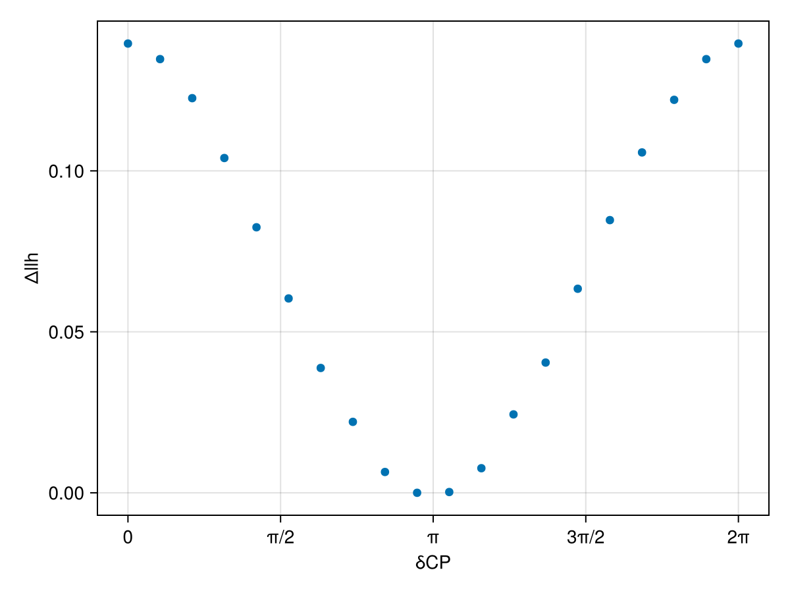

# Custom physics model

By default, each experiment configures its own physics modules. You can override this to use custom oscillation models, inverted ordering, or BSM physics. 

## Modifying the neutrino physics model
For this example, we want to configure a model that uses the inverted neutrino mass ordering and the standard matter interactions:

```julia
using Newtrinos

#modify the neutrino oscillation model 
osc_cfg = Newtrinos.osc.OscillationConfig(
    flavour     = Newtrinos.osc.ThreeFlavour(ordering=:IO), #Inverted ordering
    propagation = Newtrinos.osc.Basic(),
    states      = Newtrinos.osc.All(),
    interaction = Newtrinos.osc.SI(), #Standard matter interactions
)
osc = Newtrinos.osc.configure(osc_cfg) #oscillation configuration

#Atmospheric experiments need oscillations, fluxes, Earth density, and cross-sections:
atm_flux     = Newtrinos.atm_flux.configure()
earth_layers = Newtrinos.earth_layers.configure()
xsec         = Newtrinos.xsec.configure()

physics = (; osc, atm_flux, earth_layers, xsec) #full modified physics model
```
!!! note
    Each experiment extracts whatever physics modules it needs. Reactor experiments (Daya Bay, KamLAND) only use `osc`; atmospheric experiments use all four.

The physics model modified above can now be easily passed to an experiment of our choice to do e.g. a likelihood profile scan. 

## Passing physics to experiments
Since we are looking at standard matter effects, we need a long baseline to see effects so we could pass the model to the IceCube deepcore experiment:

```julia
experiments = (
    deepcore = Newtrinos.deepcore.configure(physics),
)
params = Newtrinos.get_params(experiments)
priors = Newtrinos.get_priors(experiments)
likelihood = Newtrinos.generate_likelihood(experiments)
```

## Likelihood profile scan
We now want to do a profile likelihood scan for e.g. different values of $\delta_{CP}$. To keep it simple and make it not too time consuming, we evaluate (only) 20 scan grid points with different $\delta_{CP}$-values. We furthermore fix $\theta_{12}$, $\theta_{13}$, $\theta_{23}$, and $\Delta m_{12}^2$ to their default values.

!!! note
    This takes a few minutes since we are optimizing over $\sim 20$ parameters to maximise the likelihood at each grid point. It may be useful to use julias multithreading for profile scans in order to accelerate the execution.

```julia 

using BAT #for combining the priors into a product of prior distributions with distprod

#combine the priors into a product of prior distributions
priors_d = distprod(;priors...) 

#find MLE to use it as starting point for the optimization
llh, log_posterior, mle_result = Newtrinos.find_mle(likelihood, priors_d, params)
```

```julia
using DataStructures #for assigning the dictionaries for conditional_vars and vars_to_scan

# Fix some parameters
conditional_vars = Dict(
        :θ₁₂ => params.θ₁₂, 
        :θ₁₃ => params.θ₁₃, 
        :Δm²₂₁ => params.Δm²₂₁, 
        :θ₂₃ => params.θ₂₃,
)
priors = Newtrinos.condition(priors, conditional_vars, params)

vars_to_scan = OrderedDict(:δCP => 20) # 20 scanpoints
result = Newtrinos.profile(likelihood, priors, vars_to_scan, mle_result)
```
    NewtrinosResult((δCP = [0.0, 0.3306939635357677, 0.6613879270715354, 0.992081890607303, 1.3227758541430708, 1.6534698176788385, 1.984163781214606, 2.3148577447503738, 2.6455517082861415, 2.9762456718219092, 3.306939635357677, 3.6376335988934447, 3.968327562429212, 4.29902152596498, 4.6297154895007475, 4.960409453036515, 5.291103416572283, 5.621797380108051, 5.9524913436438185, 6.283185307179586],), (atm_flux_delta_spectral_index = [-0.022069879743819066, -0.021919003942445295, -0.021739848199053773, -0.021562969629360502, -0.02147720344401615, -0.02137463799864237, -0.021292053771112828, -0.021252821647568833, -0.021342016443182964, -0.02142710628970914, -0.021569357897364735, -0.02177251473439103, -0.021869552523384413, -0.022091424481426904, -0.022216013291022466, -0.022295298838390806, -0.022318313152175338, -0.022288308095276356, -0.02221599950768452, -0.022069879150731636], atm_flux_nuenuebar_sigma = [0.4496455684191955, 0.4496617812513653, 0.44999368703186327, 0.44839039698633903, 0.4493589019670893, 0.4493133022549277, 0.4480822800189341, 0.44688836540991006, 0.4471564606492144, 0.4460461996602971, 0.4470659320445142, 0.44830768210893285, 0.4459610386740747, 0.44833551099208113, 0.4487952070058562, 0.4474360707748545, 0.4490651167617858, 0.450726281661572, 0.4506476304872102, 0.4496455901345404], atm_flux_nuenumu_sigma = [-0.27273340081067654, -0.27268396849653465, -0.27263009150970385, -0.2731246936192843, -0.27256943077891727, -0.2721314296157297, -0.2723032803707175, -0.2726195572649746, -0.2721016448797038, -0.27199388075896647, -0.27232627818329713, -0.27160309049375875, -0.2724392709747205, -0.2722194035441793, -0.27213222453250546, -0.2726553773086126, -0.27271591792331895, -0.27263163964042325, -0.27250119624462327, -0.27273339848311556], atm_flux_numunumubar_sigma = [-0.01971702671063676, -0.019734833446791455, -0.019586856528686494, -0.021492867344311824, -0.020341016485095082, -0.020175992093359144, -0.021450000754803595, -0.02264797694667373, -0.02199989386370046, -0.022731957729078003, -0.02233919854590171, -0.020932748712377797, -0.022899389569190604, -0.020905889698228985, -0.02031771438398833, -0.02142744388603834, -0.020113677644654538, -0.019144989911658517, -0.018940368243086078, -0.019717007455797273], atm_flux_updown_sigma = [-0.01268017857046936, -0.012629347333518759, -0.012598598489804038, -0.012465997140950778, -0.012510411575507748, -0.012526167761881627, -0.012458210936280965, -0.012402125703025148, -0.012481919172804718, -0.012483840848760653, -0.012550120182023899, -0.012728171338490545, -0.012605088504489667, -0.012778800768884968, -0.012830697368100838, -0.0127339427899523, -0.01278536123974674, -0.012845258556185084, -0.0128038010347263, -0.012680179443068967], atm_flux_uphorizonzal_sigma = [1.5247845927085741, 1.5236681594651738, 1.5217689818794018, 1.5175802200317112, 1.5153447543213372, 1.5127844845036453, 1.509090484554458, 1.5048757514612692, 1.5056180450669552, 1.505560132153396, 1.5057099857821274, 1.5099950915403728, 1.5087115044431905, 1.5144163205954022, 1.5179576861790451, 1.5203222398874856, 1.5234192445611503, 1.5266683902234728, 1.5267583378997274, 1.5247845921933614], deepcore_atm_muon_scale = [0.969110134911682, 0.9690395457696522, 0.9687822993521635, 0.9685126791534924, 0.9684090478922529, 0.9682119131950839, 0.968087357581994, 0.9678237158438189, 0.9679586759983068, 0.9680081407585024, 0.9679697470916692, 0.9683242934241925, 0.9682586875234405, 0.9687715038577334, 0.9689554766269853, 0.9691948631706622, 0.9692518613937626, 0.9692292860409122, 0.9692344263171035, 0.9691101313892292], deepcore_ice_absorption = [1.0190712818159853, 1.019005901673006, 1.0189574191478186, 1.018980367901379, 1.0188926744398428, 1.0188309343297326, 1.0187506989229607, 1.0188091078944312, 1.0187508154508826, 1.0187704628739185, 1.018761789938926, 1.0188017559536084, 1.018893190925992, 1.0189166873176456, 1.0190197627158264, 1.0190274105780663, 1.0190999596585462, 1.0191202957957397, 1.0191197718964693, 1.0190712816995584], deepcore_ice_scattering = [0.9754104747944384, 0.9754216235475971, 0.9754347982538184, 0.9754776186071479, 0.975551398144093, 0.9756011969665583, 0.9756301235131781, 0.9756883562393427, 0.9756945684617289, 0.9756990709641301, 0.9756990824082713, 0.9756837116968293, 0.9756697893250168, 0.9756265704177093, 0.9755775313346681, 0.9755421038243738, 0.9754866025726006, 0.9754473129497367, 0.9754314440406672, 0.9754104747039234], deepcore_lifetime = [2.2271320805738326, 2.227602785056847, 2.2282772294529662, 2.2290056753971337, 2.2293969484448755, 2.230049307641871, 2.230749521409974, 2.231186233431553, 2.231041858065328, 2.2311233506656194, 2.230820947000916, 2.2300649419065217, 2.2297856361940926, 2.228799549656793, 2.2281211946256687, 2.2275084984355296, 2.227101818014137, 2.2269098216965615, 2.2268068858587236, 2.227132081134639], deepcore_opt_eff_headon = [-1.656068319020143, -1.6577692127009813, -1.6585524146819672, -1.6579583403123013, -1.657182983617881, -1.656095209817011, -1.6550047987148497, -1.650865873267378, -1.6516458580268898, -1.6483073198378762, -1.6481091090124211, -1.6454770844640083, -1.6447494854032803, -1.6446166412173193, -1.6450574907480657, -1.6477306293517389, -1.6488087197167105, -1.650241758909079, -1.6529398333616672, -1.656068340709603], deepcore_opt_eff_lateral = [-0.18255133734450082, -0.18275345346872923, -0.1824396081004814, -0.18212257713197408, -0.18266453318566095, -0.18291014724836813, -0.18361298613611576, -0.1822646581695019, -0.18484141703598841, -0.18403778927769873, -0.18481542044829044, -0.184481216503053, -0.18424789061414104, -0.1844014394478896, -0.18398354901324987, -0.18467942897339576, -0.18322331700122804, -0.1822381278378831, -0.18230141141730952, -0.1825513381306385], deepcore_opt_eff_overall = [1.0531453115175575, 1.0529449390155863, 1.0527061608020585, 1.0524918051557663, 1.0524325596388606, 1.0523082968246391, 1.0521410338839927, 1.052087296197525, 1.0522319979386112, 1.0522758850267055, 1.0523679265171366, 1.052701759896116, 1.0527866614676231, 1.0530414962019863, 1.0532147248417563, 1.0533318295624274, 1.0533547650103061, 1.0533211177600157, 1.0533098485587447, 1.053145311270432], nc_norm = [1.2583270013073222, 1.2582386559736942, 1.2580416156102838, 1.2582187674457161, 1.2575659281498732, 1.256947002231531, 1.2568848588443993, 1.2569422270436283, 1.2564638974601026, 1.256375921514348, 1.256674822008299, 1.2560659318793286, 1.2570215722182312, 1.2570375229132473, 1.2571848618056973, 1.2579551535569404, 1.2581778150472585, 1.258115179269753, 1.258076570963393, 1.2583269997184265], nutau_cc_norm = [0.9196161000129413, 0.919845587387803, 0.9201951874327126, 0.9202592033041539, 0.9207859685231039, 0.9210657459259987, 0.9211644241266632, 0.921262898116575, 0.9212260070870915, 0.9209000591669252, 0.9210768009015137, 0.9207058308133966, 0.9202522585669171, 0.9201080511333066, 0.9197978709369172, 0.9192992910063388, 0.9193796814000663, 0.9194116913399875, 0.9194853259189986, 0.9196161062227461], Δm²₂₁ = [7.53e-5, 7.53e-5, 7.53e-5, 7.53e-5, 7.53e-5, 7.53e-5, 7.53e-5, 7.53e-5, 7.53e-5, 7.53e-5, 7.53e-5, 7.53e-5, 7.53e-5, 7.53e-5, 7.53e-5, 7.53e-5, 7.53e-5, 7.53e-5, 7.53e-5, 7.53e-5], Δm²₃₁ = [-0.00224828611827625, -0.002248869859093192, -0.0022495432230636636, -0.002250100568326749, -0.002250006860980358, -0.002250335134294289, -0.002250553050116638, -0.0022504332338005094, -0.0022499907389296227, -0.0022497870530769747, -0.002249524771852281, -0.0022485208356346153, -0.0022484053591070472, -0.0022475574376985665, -0.0022473479592003236, -0.002247414816182864, -0.002247364801260382, -0.0022475860506421005, -0.002247784245838337, -0.002248286121194701], δCP = [0.0, 0.3306939635357677, 0.6613879270715354, 0.992081890607303, 1.3227758541430708, 1.6534698176788385, 1.984163781214606, 2.3148577447503738, 2.6455517082861415, 2.9762456718219092, 3.306939635357677, 3.6376335988934447, 3.968327562429212, 4.29902152596498, 4.6297154895007475, 4.960409453036515, 5.291103416572283, 5.621797380108051, 5.9524913436438185, 6.283185307179586], θ₁₂ = [0.5872523687443223, 0.5872523687443223, 0.5872523687443223, 0.5872523687443223, 0.5872523687443223, 0.5872523687443223, 0.5872523687443223, 0.5872523687443223, 0.5872523687443223, 0.5872523687443223, 0.5872523687443223, 0.5872523687443223, 0.5872523687443223, 0.5872523687443223, 0.5872523687443223, 0.5872523687443223, 0.5872523687443223, 0.5872523687443223, 0.5872523687443223, 0.5872523687443223], θ₁₃ = [0.1454258194533693, 0.1454258194533693, 0.1454258194533693, 0.1454258194533693, 0.1454258194533693, 0.1454258194533693, 0.1454258194533693, 0.1454258194533693, 0.1454258194533693, 0.1454258194533693, 0.1454258194533693, 0.1454258194533693, 0.1454258194533693, 0.1454258194533693, 0.1454258194533693, 0.1454258194533693, 0.1454258194533693, 0.1454258194533693, 0.1454258194533693, 0.1454258194533693], θ₂₃ = [0.8556288707523761, 0.8556288707523761, 0.8556288707523761, 0.8556288707523761, 0.8556288707523761, 0.8556288707523761, 0.8556288707523761, 0.8556288707523761, 0.8556288707523761, 0.8556288707523761, 0.8556288707523761, 0.8556288707523761, 0.8556288707523761, 0.8556288707523761, 0.8556288707523761, 0.8556288707523761, 0.8556288707523761, 0.8556288707523761, 0.8556288707523761, 0.8556288707523761], llh = [-539.8049330827723, -539.8000995927374, -539.7879674610238, -539.7693727710589, -539.7478591513834, -539.7257541746723, -539.704159240741, -539.6874199146595, -539.6718475355148, -539.6653841469893, -539.6656193534601, -539.6730184408678, -539.6897364866329, -539.7058365790302, -539.7287652283887, -539.7500852351102, -539.7711101641992, -539.7874498959673, -539.8000873576898, -539.8049331000268], log_posterior = [-536.8724415703206, -536.8633592428273, -536.8446617355287, -536.8185394855576, -536.7878966091191, -536.7561749362466, -536.7267827380431, -536.7028017992154, -536.6866081025026, -536.679917005843, -536.6833979284575, -536.6966652820921, -536.7185192103873, -536.7466072525207, -536.7780786086615, -536.8095386882973, -536.8374514171492, -536.8586924671218, -536.870822946445, -536.8724415703315]), Dict{String, Any}("repo_clean" => false, "exec_time" => 830.813000202179, "username" => "David", "repo" => "c:\\Users\\David\\IceCube_project\\Newtrinos.jl", "cache_dir" => nothing, "hostname" => "DESKTOP-QSI7DD1", "params" => (atm_flux_delta_spectral_index = 0.0, atm_flux_nuenuebar_sigma = 0.0, atm_flux_nuenumu_sigma = 0.0, atm_flux_numunumubar_sigma = 0.0, atm_flux_updown_sigma = 0.0, atm_flux_uphorizonzal_sigma = 0.0, deepcore_atm_muon_scale = 1.0, deepcore_ice_absorption = 1.0, deepcore_ice_scattering = 1.0, deepcore_lifetime = 2.5, deepcore_opt_eff_headon = 0.0, deepcore_opt_eff_lateral = 0.0, deepcore_opt_eff_overall = 1.0, nc_norm = 1.0, nutau_cc_norm = 1.0, Δm²₂₁ = 7.53e-5, Δm²₃₁ = -0.0024, δCP = 1.0, θ₁₂ = 0.5872523687443223, θ₁₃ = 0.1454258194533693, θ₂₃ = 0.8556288707523761), "date" => "2026-06-22 21:54:52", "task" => "profile", "vars_to_scan" => OrderedDict(:δCP => 20)…)) 

We can also briefly plot the Likelihood profile:
```julia
using CairoMakie

fig, ax, plt = scatter(result.axes.δCP, maximum(result.values.llh) .- result.values.llh)

ax.xlabel = "δCP"
ax.ylabel = "Δllh"
ax.xticks = ([0, π/2, π, 3π/2, 2π], ["0", "π/2", "π", "3π/2", "2π"])

fig
```

