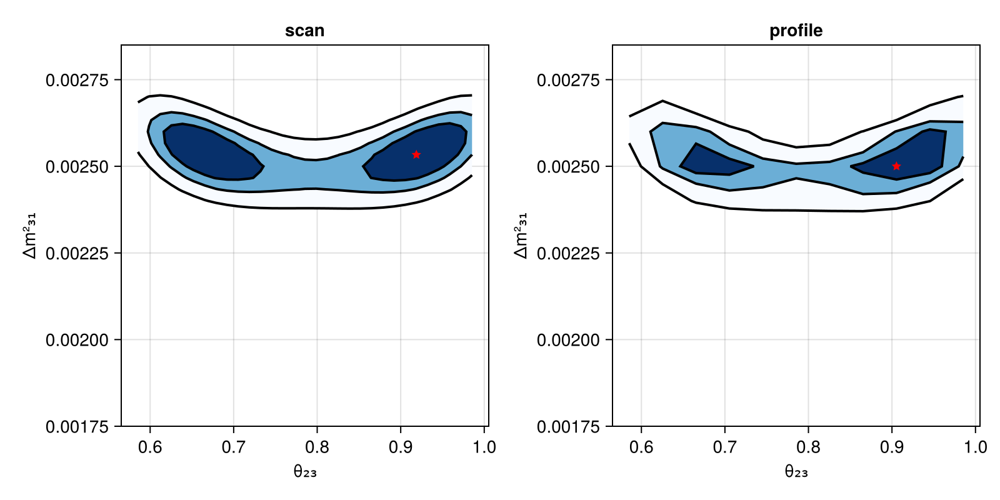

# Joint Analysis

This example shows how to combine multiple experiments into a joint likelihood and run profile/scan analyses. For simplicity we use the default physics configuration.

## Combining Experiments

```julia
using Newtrinos
using DensityInterface
using DataStructures

experiments = (
    dayabay  = Newtrinos.dayabay.configure(),
    kamland  = Newtrinos.kamland.configure(),
    minos    = Newtrinos.minos.configure(),
)
```

Parameters and priors are automatically merged across all experiments and their physics modules:

```julia
params = Newtrinos.get_params(experiments)
priors = Newtrinos.get_priors(experiments)
likelihood = Newtrinos.generate_likelihood(experiments)
```

## Conditioning (Fixing Parameters)

Fix parameters to specific values before scanning:

```julia
conditional_vars = Dict(
    :θ₁₂   => params.θ₁₂,
    :δCP   => 0.0,
    :Δm²₂₁ => params.Δm²₂₁,
)
priors = Newtrinos.condition(priors, conditional_vars, params)
```

## Likelihood Scan

A scan evaluates the likelihood on a grid without optimization:

```julia
using Distributions, Accessors

@reset priors.θ₂₃ = Uniform(pi/4 - 0.2, pi/4 + 0.2)
@reset priors.Δm²₃₁ = Uniform(0.0018, 0.0028)

vars_to_scan = OrderedDict(:θ₂₃ => 31, :Δm²₃₁ => 31)
result_scan = Newtrinos.scan(likelihood, priors, vars_to_scan, params)
```

## Profile Likelihood

A profile scan optimizes over nuisance parameters at each grid point:

```julia
vars_to_scan = OrderedDict(:θ₂₃ => 11, :Δm²₃₁ => 11)
result_profile = Newtrinos.profile(likelihood, priors, vars_to_scan, params; cache_dir="my_profile")
```

Results are cached to disk, so interrupted runs can be resumed.

## Extracting Best Fit

```julia
bf_scan = Newtrinos.bestfit(result_scan)
bf_profile = Newtrinos.bestfit(result_profile)
```

## Plotting Results

```julia
using CairoMakie

fig = Figure(size=(800,400))
ax1 = Axis(fig[1, 1], xlabel="θ₂₃", ylabel="Δm²₃₁", title="scan")
plot!(ax1, result_scan, levels=[0, 0.68, 0.9, 0.99], filled=true, color=:black,cmap=Reverse(:Blues))
scatter!(ax1, bf_scan.θ₂₃, bf_scan.Δm²₃₁, marker=:star5, color=:red)

ax2 = Axis(fig[1, 2], xlabel="θ₂₃", ylabel="Δm²₃₁", title="profile")
plot!(ax2, result_profile, levels=[0, 0.68, 0.9, 0.99], filled=true, color=:black, cmap=Reverse(:Blues))
scatter!(ax2, bf_profile.θ₂₃, bf_profile.Δm²₃₁, marker=:star5, color=:red)
fig
```

