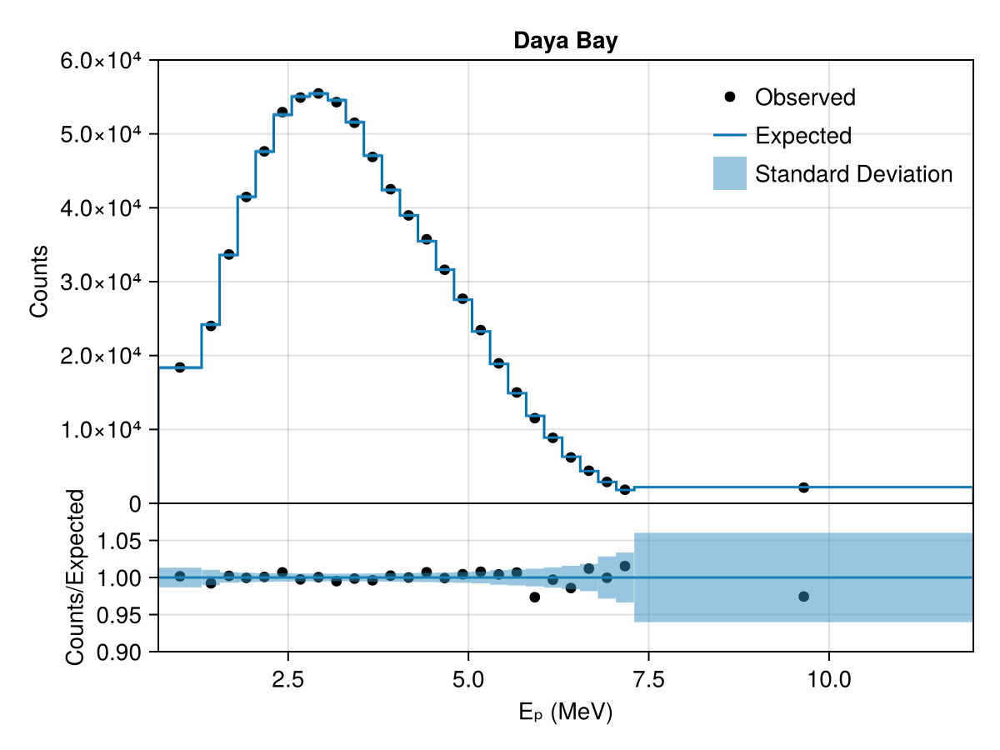

# Single Experiment

This example shows how to configure a single experiment with default physics and explore its likelihood by visualizing it and running a simple likelihood scan.

Load the required packages:

```julia
using Newtrinos
using DensityInterface
```

## Configuring an Experiment

Each experiment has a `configure()` function that returns a struct with everything needed for analysis. We choose the dayabay experiment. For the default physics model we dont need to specify the physis model in the `configure()` function:

```julia
exp = Newtrinos.dayabay.configure()
```

The returned struct contains:
- `physics` — configured physics modules (oscillations, etc.)
- `params` — nominal parameter values (NamedTuple)
- `priors` — prior distributions (NamedTuple)
- `assets` — data, MC, interpolations, etc.
- `forward_model` — callable that maps parameters to a predicted distribution
- `plot` — visualization function

## Extracting Parameters and Priors

Wrap the experiment in a NamedTuple and use the accessor functions to collect the physical and experimental parameters and priors as NamedTuples:

```julia
experiments = (; dayabay = exp)
params = Newtrinos.get_params(experiments)
priors = Newtrinos.get_priors(experiments)
```

`get_params` and `get_priors` recursively merge parameters from both the experiment and its physics modules, checking for conflicts.

## Evaluating the Likelihood

We use the function `generate_likelihood()` to calculate the likelihood function for the experiment. If there were more than one experiment, then this would be a joint likelihood.

```julia
likelihood = Newtrinos.generate_likelihood(experiments)
```

When you want to work with the log-likelihood function, you can convert it via:

```julia
llh = logdensityof(likelihood, params)
```

The maximum likelihood estimator (MLE) can be calculated with 
```julia 
#combine the priors into a product of prior distributions
using BAT #need BAT.jl for the distprod function
priors_d = distprod(;priors...)

#find MLE
llh, log_posterior, mle_result = Newtrinos.find_mle(likelihood, priors_d, params)
```
    (-167.51732270714922, -147.89296401643702, (Δm²₂₁ = 8.030943005942308e-5, Δm²₃₁ = 0.002559808085219558, δCP = 0.9999999999999737, θ₁₂ = 0.6552513448720412, θ₁₃ = 0.14798653181352067, θ₂₃ = 0.8556288707523761))


## Plotting

Most of the experiments provide a `plot` function. We can use this to visualize a comparison of the observed data with the expected data based on the MLE parameter values:

```julia
img = experiments.dayabay.plot(mle_result)
display("image/png", img)
```


## Running a Scan
For analyses, we might want to look at the likelihood values for a certain range of e.g. the reactor mixing angle $\theta_{13}$. For this, we can use a simple Likelihood scan that sets every other parameter to its default value and scans the likelihood over the prior range. If we want to condition a parameter to a certain value, we can use the `condition` function for that or use Accessors.jl directly. `The vars_to_scan` dict specifies the number of equidistant scanpoints within the prior range. 

```julia
using DataStructures

# Fix some parameters
conditional_vars = Dict(:θ₁₂ => params.θ₁₂)
priors = Newtrinos.condition(priors, conditional_vars, params)

vars_to_scan = OrderedDict(:θ₁₃ => 21) # 21 scanpoints
result = Newtrinos.scan(likelihood, priors, vars_to_scan, params)
```
    NewtrinosResult((θ₁₃ = [0.1, 0.10500000000000001, 0.11000000000000001, 0.115, 0.12000000000000001, 0.125, 0.13, 0.135, 0.14, 0.14500000000000002  …  0.15500000000000003, 0.16, 0.165, 0.16999999999999998, 0.17500000000000002, 0.18000000000000002, 0.185, 0.19, 0.195, 0.2],), (Δm²₂₁ = [8.030943005942308e-5, 8.030943005942308e-5, 8.030943005942308e-5, 8.030943005942308e-5, 8.030943005942308e-5, 8.030943005942308e-5, 8.030943005942308e-5, 8.030943005942308e-5, 8.030943005942308e-5, 8.030943005942308e-5  …  8.030943005942308e-5, 8.030943005942308e-5, 8.030943005942308e-5, 8.030943005942308e-5, 8.030943005942308e-5, 8.030943005942308e-5, 8.030943005942308e-5, 8.030943005942308e-5, 8.030943005942308e-5, 8.030943005942308e-5], Δm²₃₁ = [0.002559808085219558, 0.002559808085219558, 0.002559808085219558, 0.002559808085219558, 0.002559808085219558, 0.002559808085219558, 0.002559808085219558, 0.002559808085219558, 0.002559808085219558, 0.002559808085219558  …  0.002559808085219558, 0.002559808085219558, 0.002559808085219558, 0.002559808085219558, 0.002559808085219558, 0.002559808085219558, 0.002559808085219558, 0.002559808085219558, 0.002559808085219558, 0.002559808085219558], δCP = [0.9999999999999737, 0.9999999999999737, 0.9999999999999737, 0.9999999999999737, 0.9999999999999737, 0.9999999999999737, 0.9999999999999737, 0.9999999999999737, 0.9999999999999737, 0.9999999999999737  …  0.9999999999999737, 0.9999999999999737, 0.9999999999999737, 0.9999999999999737, 0.9999999999999737, 0.9999999999999737, 0.9999999999999737, 0.9999999999999737, 0.9999999999999737, 0.9999999999999737], θ₁₂ = [0.6552513448720412, 0.6552513448720412, 0.6552513448720412, 0.6552513448720412, 0.6552513448720412, 0.6552513448720412, 0.6552513448720412, 0.6552513448720412, 0.6552513448720412, 0.6552513448720412  …  0.6552513448720412, 0.6552513448720412, 0.6552513448720412, 0.6552513448720412, 0.6552513448720412, 0.6552513448720412, 0.6552513448720412, 0.6552513448720412, 0.6552513448720412, 0.6552513448720412], θ₂₃ = [0.8556288707523761, 0.8556288707523761, 0.8556288707523761, 0.8556288707523761, 0.8556288707523761, 0.8556288707523761, 0.8556288707523761, 0.8556288707523761, 0.8556288707523761, 0.8556288707523761  …  0.8556288707523761, 0.8556288707523761, 0.8556288707523761, 0.8556288707523761, 0.8556288707523761, 0.8556288707523761, 0.8556288707523761, 0.8556288707523761, 0.8556288707523761, 0.8556288707523761], llh = [-268.31466049062885, -252.02419890426034, -236.4218639114421, -221.73999521068032, -208.22676182563646, -196.14693046810694, -185.78268790131804, -177.43452031182292, -171.42215292349076, -168.0855533268919  …  -170.90723579321417, -177.8566633572675, -189.06666597437734, -204.99597987149932, -226.13117062063876, -252.9882035256163, -286.11411632571173, -326.08880072878503, -373.5268997527651, -429.07982835376464], log_posterior = [-268.31466049062885, -252.02419890426034, -236.4218639114421, -221.73999521068032, -208.22676182563646, -196.14693046810694, -185.78268790131804, -177.43452031182292, -171.42215292349076, -168.0855533268919  …  -170.90723579321417, -177.8566633572675, -189.06666597437734, -204.99597987149932, -226.13117062063876, -252.9882035256163, -286.11411632571173, -326.08880072878503, -373.5268997527651, -429.07982835376464]), Dict{String, Any}("repo_clean" => false, "exec_time" => 1.1070001125335693, "username" => "David", "repo" => "c:\\Users\\David\\IceCube_project\\Newtrinos.jl", "hostname" => "DESKTOP-QSI7DD1", "params" => (Δm²₂₁ = 8.030943005942308e-5, Δm²₃₁ = 0.002559808085219558, δCP = 0.9999999999999737, θ₁₂ = 0.6552513448720412, θ₁₃ = 0.14798653181352067, θ₂₃ = 0.8556288707523761), "date" => "2026-06-22 19:18:30", "task" => "scan", "vars_to_scan" => OrderedDict(:θ₁₃ => 21), "commit_hash" => "c23e6b5ac029873c75a9a2678ebbc98c5c90b247"…))

The scan returns a NewtrinosResult object that contains the scan axes values, the log-likelihood and log-posterior at every scan point and meta data of the execution.