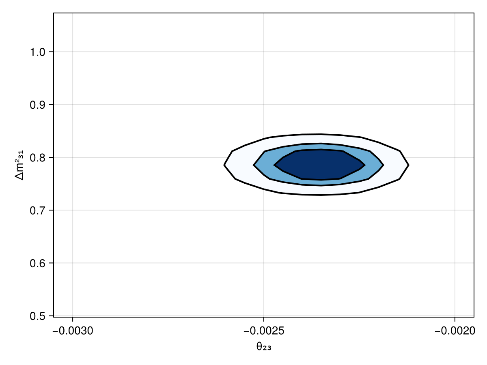

# First steps
This section provides a simple starting example to give you a basic idea of how the Newtrinos.jl package works. It is NOT thought as a tutorial. We just want to guide you through how it basically works and is structured. Like riding a bike for the first time, but with training wheels.

## Structure of the package
The Newtrinos.jl architecture is organized into three orthogonal layers:
- Physics layer: configure the theoretical physics models
- Experiment layer: configure the experimental likelihoods
- Analysis layer: analyse the data from the given experiments for a given physics model

Each layer treats the other layers as black boxes. This way, the package allows a flexible composition for statistical analysis of neutrino data.

## Example: 
In this first example we define a physics model that contains decoherent neutrino propagation, standard matter interactions, and uses the inverted mass ordering. As experiment we choose the IceCube deepcore neutrino experiment. We want to evaluate the log-likelihood for this case. 

### Load the package:
If Newtrinos.jl is not installed yet on your machine you need to install it first. You can find the installation instructions [here](installation.md). If it's already installed load the package via: 

```julia
using Newtrinos
using DensityInterface #need this for calculating the log-likelihood later
```

### Configure the physics model:
We want now to specify the physics model we want to investigate. 

`Newtrinos.osc.OscillationConfig(...)` creates an oscillation configuration by combining a flavour model, propagation model, eigenstate selection strategy, interaction model, and eigendecomposition algorithm. Calling it without arguments returns the default configuration (3-flavour, vacuum interactions, basic propagation, all states, default eigendecomposition).

```julia 
osc_cfg = Newtrinos.osc.OscillationConfig(
    flavour     = Newtrinos.osc.ThreeFlavour(ordering=:IO), # use inverted mass ordering
    propagation = Newtrinos.osc.Decoherent(), # use decoherent propagation
    interaction = Newtrinos.osc.SI(), # use standard MSW effect
)
```

Then use `Newtrinos.osc.configure(oscillation_config)` to pass all relevant parameters, priors, matrices from the configuration into the Osc struct, i.e. Create a fully configured oscillation physics model from the given configuration. 

```julia 
osc_model = Newtrinos.osc.configure(osc_cfg)
```

Assemble the full physics model by combining the oscillation model with flux models, earth/matter models, and cross-section models.

```julia
atm_flux     = Newtrinos.atm_flux.configure() # atmospherical flux
earth_layers = Newtrinos.earth_layers.configure() # earth layer density model
xsec         = Newtrinos.xsec.configure() # standard cross section model

physics = (; osc=osc_model, atm_flux, earth_layers, xsec)
```

### Configure the experiment: 
The experiments are all configured in the source code and all you need to do is to pass a physics module. Each experiment extracts whatever part of the physics module it needs. While Reactor experiments only use the oscillation model, atmospherical neutrino experiments need the full physics model. 

We pass the physics module to an experiment via the configure method of each experiment. Without specifying a physics module, the default physics is used for the experiment configuration.

```julia
exp = Newtrinos.deepcore.configure(physics)
experiments = (; deepcore = exp)
```

Now this returns a struct containing physics models, parameters, priors, data assets, and a forward model. Since the Analysis methods require a NamedTuple of experiment structs the exp is organized into a NamedTuple in the second line.

### Evaluate the likelihood
Extract parameters and evaluate the likelihood:

```julia
params = Newtrinos.get_params(experiments)
priors = Newtrinos.get_priors(experiments)
likelihood = Newtrinos.generate_likelihood(experiments)
```

### Quick likelihood scan
We can span a 2D grid of $\theta_{23}$ and $\Delta m^2_{31}$ values and evaluate the likelihood at each grid-point while keeping the other parameters at their default values. 

```julia 
using DataStructures
vars_to_scan = OrderedDict(:Δm²₃₁ => 21, :θ₂₃ => 21) #21 x 21 scanpoints
result = Newtrinos.scan(likelihood, priors, vars_to_scan, params)
```

We can also plot a CL contour plot with the built-in `plot` function of Newtrinos.jl.

```julia
using CairoMakie
fig = Figure()
ax = Axis(fig[1, 1], xlabel="θ₂₃", ylabel="Δm²₃₁")
plot!(ax, result, levels=[0, 0.68, 0.9, 0.99], filled=true, color=:black, cmap=Reverse(:Blues))
fig
```


## Next Step
Go to the [tutorials](tutorials/) and work through the features in more detail to understand how the package works and to be able to do own analyses with Newtrinos.jl
