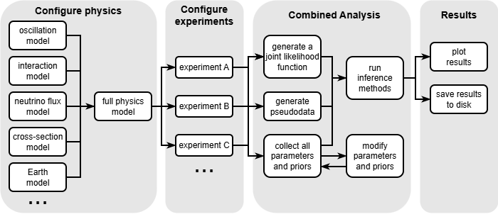

# Newtrinos.jl

**Newtrinos.jl** is a Julia package for the **global analysis of neutrino data**. It is fully open source and free to use under the MIT license.

The package is built to support flexible and modular analysis of neutrino physics, combining experimental data with physics models and inference tools. It supports both **Frequentist** (profile likelihood) and **Bayesian** (nested sampling, importance sampling) inference methods.

The key features of the package are: 

- **11 experiments**: IceCube DeepCore, Daya Bay, KamLAND, MINOS, Super-Kamiokande, ORCA, JUNO, TAO, COHERENT CsI/LAr, IceCube Upgrade
- **Modular physics**: Oscillations (3-flavour, sterile, ADD, dark dimensions), matter effects (SI, NSI), atmospheric fluxes, cross-sections
- **Fully differentiable**: All code supports ForwardDiff automatic differentiation for gradient-based optimization
- **Scalable**: Threaded and distributed parallelism for profile likelihood scans

## Typical Workflow
An example of a typical workflow for a global analysis of Newtrinos.jl is visualized in the below picture. The layers communicate through two well-defined interfaces: NamedTuples of parameters and priors, and callable functions stored in structs.

## Julia programming language

The package is written in Julia. If you're not yet familiar with Julia and want to learn more about the language, here are a few resources to get started:
- the [Julia Website](https://julialang.org/) offers many links to introductory videos and written tutorials. 
- there also exists a [MATLAB-Python-Julia cheatsheet](https://cheatsheets.quantecon.org/)
- this [article](https://www.stochasticlifestyle.com/why-numba-and-cython-are-not-substitutes-for-julia/) explains how Julia adresses several fundamental challenges inherent to scientific high-performance computing

## References

Newtrinos.jl has been used to produce the results presented in:

- [Testing the number of neutrino species with a global fit of neutrino data](https://arxiv.org/abs/2402.00490) — Phys.Rev.D 109 (2024) 9, 095016
- [Constraints on non-unitary neutrino mixing in light of atmospheric and reactor neutrino data](https://arxiv.org/abs/2407.20388) — JHEP 05 (2025) 130
- [A neutrino data analysis of extra-dimensional theories with massive bulk fields](https://arxiv.org/abs/2508.04274) — Phys.Rev.D 112 (2025) 5, 055009
