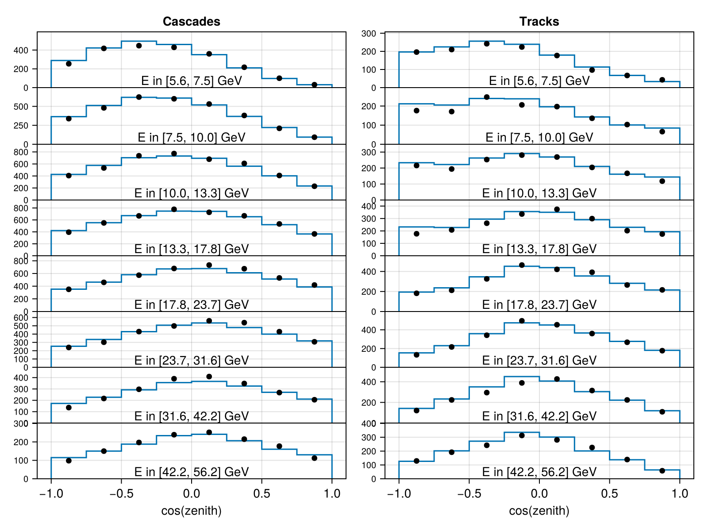
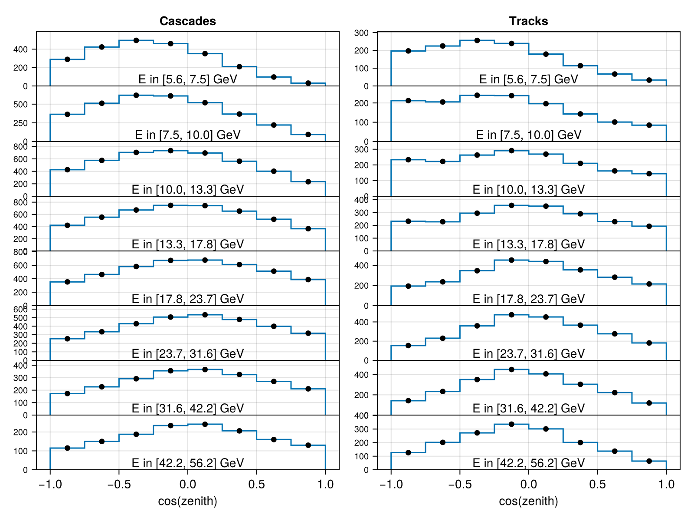

# Configuring Experiments

This tutorial walks through the full experiment configuration workflow: from calling `configure()` to evaluating the likelihood and generating data. For the list of all available experiments, see [Experiments](experiments.md). For physics module setup, see [Physics Model Tutorial](physics_model.md).

---

## Configuring with Default Physics

Every experiment defines its own `default_physics()` internally, choosing the right oscillation model, flux, Earth density profile, and cross-section for its measurement. Calling `configure()` with no arguments uses these defaults — the simplest way to get started:

```julia
using Newtrinos

# Reactor experiment — default physics is vacuum oscillations only
dayabay = Newtrinos.dayabay.configure()

# Atmospheric experiment — default physics is SI matter effects + HKKM flux + PREM Earth
deepcore = Newtrinos.deepcore.configure()
```

This is the recommended starting point. If you do not need to change the physics model (e.g. you are just evaluating the standard three-flavour likelihood), default physics is all you need.

---

## Configuring with Custom Physics

To use a non-default oscillation model — inverted ordering, sterile neutrinos, NSI, etc. — assemble a physics `NamedTuple` and pass it to `configure()`. Each experiment extracts only the modules it needs; extra keys are silently ignored.

```julia
using Newtrinos

# Build a custom oscillation module (inverted ordering, matter effects)
osc_cfg = Newtrinos.osc.OscillationConfig(
    flavour     = Newtrinos.osc.ThreeFlavour(ordering = :IO),
    interaction = Newtrinos.osc.SI(),
    propagation = Newtrinos.osc.Basic(),
)
osc = Newtrinos.osc.configure(osc_cfg)

# Assemble the full physics NamedTuple
atm_flux     = Newtrinos.atm_flux.configure()
earth_layers = Newtrinos.earth_layers.configure()
xsec         = Newtrinos.xsec.configure()
physics      = (; osc, atm_flux, earth_layers, xsec)

# Pass it to any experiment
deepcore = Newtrinos.deepcore.configure(physics)

# Reactor experiments only use osc — the extra modules are harmless
dayabay = Newtrinos.dayabay.configure(physics)
```

!!! tip
    You can reuse the same `physics` NamedTuple across multiple experiments. Each experiment picks up only the modules it needs, so sharing one physics object across a joint analysis is both correct and efficient.

---

## Inspecting the Configured Experiment

`configure()` returns an experiment struct containing five fields you will commonly interact with:

```julia
exp = Newtrinos.deepcore.configure()

exp.physics       # the physics modules that were passed in (or default_physics())
exp.params        # experiment-specific nominal parameter values (detector systematics, etc.)
exp.priors        # prior distributions for those parameters
exp.assets        # read-only data: MC templates, observed event counts, etc.
exp.forward_model # Function: params -> distribution
exp.plot          # Function: params -> CairoMakie Figure
```

### Experiment-specific parameters

Different experiments have different numbers of systematic parameters. Reactor experiments like Daya Bay have none — their only free parameters come from the oscillation physics:

```julia
dayabay = Newtrinos.dayabay.configure()
dayabay.params    # (;)  — empty NamedTuple
dayabay.priors    # (;)  — empty NamedTuple
```

Atmospheric experiments like DeepCore have detector systematics that model ice properties, optical efficiency, and atmospheric muon contamination:

```julia
deepcore = Newtrinos.deepcore.configure()
deepcore.params
# (deepcore_aeff_scale = 1.0, deepcore_atm_muon_scale = 1.0,
#  deepcore_ice_absorption = 1.0, deepcore_ice_scattering = 1.0,
#  deepcore_opt_eff_overall = 1.0, deepcore_rel_eff_p0 = 0.1, ...)

deepcore.priors
# (deepcore_aeff_scale = Uniform(0.5, 2.0),
#  deepcore_ice_absorption = Uniform(0.8, 1.2),
#  deepcore_opt_eff_overall = Truncated(Normal(1.0, 0.1), 0.8, 1.2), ...)
```

### Merging all parameters

Use `get_params` and `get_priors` to obtain a single flat `NamedTuple` that merges the physics parameters with the experiment-specific parameters:

```julia
params = Newtrinos.get_params(deepcore)
# → (θ₁₂ = ..., θ₁₃ = ..., θ₂₃ = ..., δCP = ..., Δm²₂₁ = ..., Δm²₃₁ = ...,
#    atm_flux_delta_spectral_index = ..., deepcore_aeff_scale = ..., ...)

priors = Newtrinos.get_priors(deepcore)
```

This merged `params` is the full parameter vector expected by `forward_model` and all analysis functions.

---

## Evaluating the Forward Model

`forward_model(params)` maps a parameter vector to a statistical distribution over the observed data space. For most experiments this is a `ProductDistribution` of independent Poisson distributions — one per histogram bin.

```julia
using DensityInterface, Statistics

exp    = Newtrinos.deepcore.configure()
params = Newtrinos.get_params(exp)

# Evaluate the expected event distribution at the nominal parameters
dist = exp.forward_model(params)

# Expected event counts per bin (the Poisson means)
expected = mean(dist)

# Log-likelihood: how well does the model describe the observed data?
llh = logdensityof(dist, exp.assets.observed)
```

The `logdensityof` call is the core of the likelihood evaluation. It computes $\log \mathcal{L}(\text{params} \mid \text{data})$ given the forward model prediction and the stored observed data.

---

## Plotting Data vs Model

Each experiment provides a `plot` function that renders a comparison between the model prediction and the observed data. It requires a Makie backend to be loaded:

```julia
using CairoMakie

exp    = Newtrinos.deepcore.configure()
params = Newtrinos.get_params(exp)

# Plot model at nominal parameters vs observed data
fig = exp.plot(params)

# Save to file
save("deepcore_comparison.png", fig)
```



```julia
# Plot model vs a custom data array (e.g. Asimov data)
asimov = Newtrinos.generate_asimov_data(exp, params)
fig_asimov = exp.plot(params, asimov)
```



---

## Generating Asimov and Toy Data

Asimov data is the expected event count at the given parameter values — the Poisson mean of the forward model, rounded to the nearest integer. It is useful for sensitivity studies and bias tests where you want a "perfect" dataset with no statistical fluctuations.

Toy data is a single random draw from the forward model — a statistically fluctuated pseudo-experiment.

```julia
exp    = Newtrinos.dayabay.configure()
params = Newtrinos.get_params(exp)

# Asimov data: the Poisson mean (no fluctuations)
asimov = Newtrinos.generate_asimov_data(exp, params)

# Toy data: one random pseudo-experiment
toy = Newtrinos.generate_toy_data(exp, params)

# Evaluate the likelihood on the toy dataset
dist = exp.forward_model(params)
logdensityof(dist, toy)
```

!!! note
    JUNO and TAO have no observed data — their `assets.observed` field contains Asimov data generated at the nominal parameters. This is the standard approach for prospective sensitivity analyses of future experiments.

---

## Combining Multiple Experiments

To build a joint likelihood across multiple experiments, collect them into a `NamedTuple`
and pass it to the analysis functions:

```julia
experiments = (
    deepcore = Newtrinos.deepcore.configure(physics),
    dayabay  = Newtrinos.dayabay.configure(physics),
    kamland  = Newtrinos.kamland.configure(physics),
)

# Merged parameter vector across all experiments and their physics
params = Newtrinos.get_params(experiments)
priors = Newtrinos.get_priors(experiments)

# Joint likelihood callable
likelihood = Newtrinos.generate_likelihood(experiments)

# Evaluate at nominal parameters
using DensityInterface
logdensityof(likelihood, params)
```

The joint likelihood is the sum of the individual likelihoods. Shared oscillation parameters (e.g. `θ₂₃`) appear only once in `params`, since `safe_merge` ensures no parameter name is duplicated across experiments or physics modules.

For running scans and profile likelihoods over this joint likelihood, see the [Analysis API Reference](../api/analysis.md).
