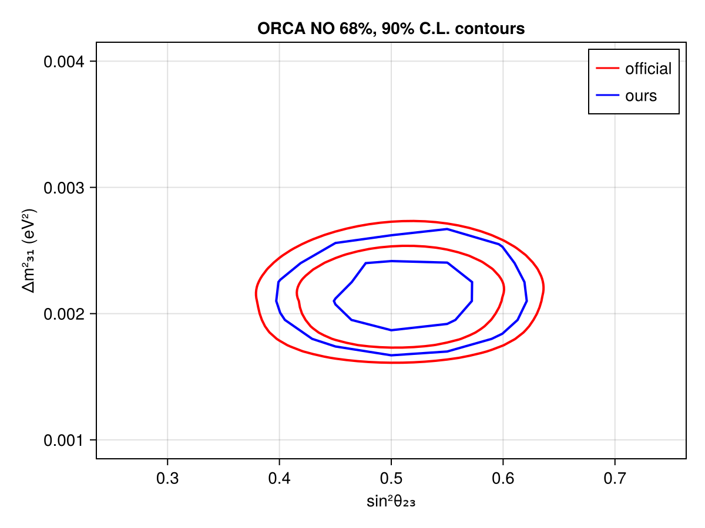
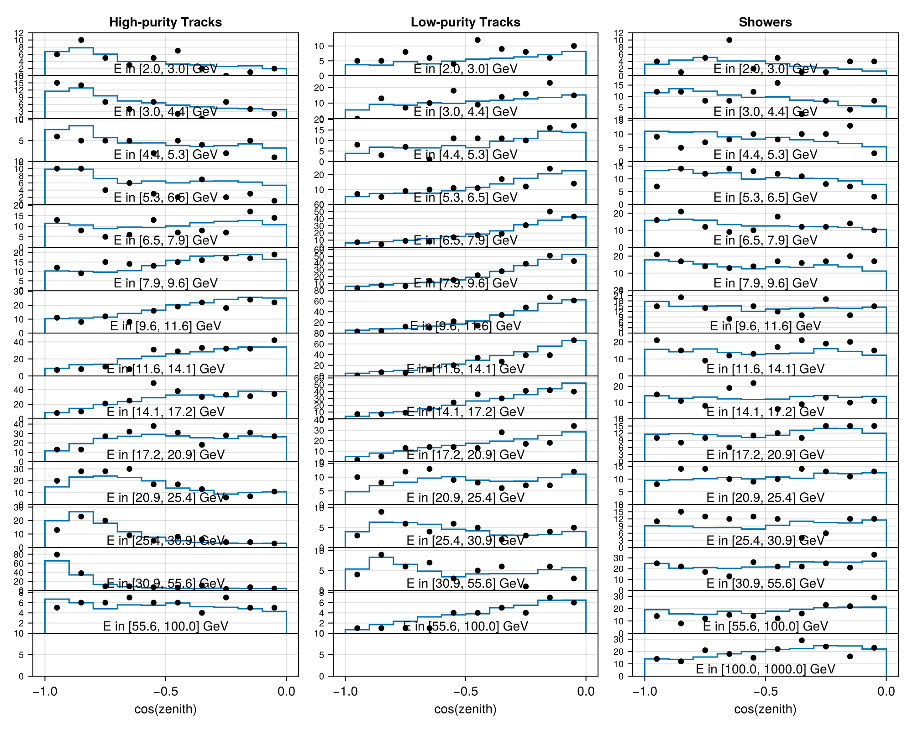

# KM3NeT ORCA6 433 k-ton Sample
 ## Resources
Data source: https://opendata.km3net.de/dataset.xhtml?persistentId=doi:10.5072/FK2/Y0UXVW

## Test output plots

## Meta Information
- **repo_clean**: true
- **exec_time**: 13853.014309883118
- **username**: peller
- **nseeds**: 1
- **repo**: /mnt/c/Users/peller/work/claude/Newtrinos.jl
- **cache_dir**: test
- **sequential**: false
- **hostname**: flippy
- **params**: (atm_flux_delta_spectral_index = 0.0, atm_flux_norm_ratio_hi = 1.0, atm_flux_norm_ratio_lo = 1.0, atm_flux_nuenuebar_sigma_hi = 0.0, atm_flux_nuenuebar_sigma_lo = 0.0, atm_flux_nuenuebar_sigma_mid = 0.0, atm_flux_nuenumu_sigma_hi = 0.0, atm_flux_nuenumu_sigma_lo = 0.0, atm_flux_nuenumu_sigma_mid = 0.0, atm_flux_numunumubar_sigma_hi = 0.0, atm_flux_numunumubar_sigma_lo = 0.0, atm_flux_numunumubar_sigma_mid = 0.0, atm_flux_updown_sigma = 0.0, atm_flux_uphorizontal_sigma = 0.0, orca_energy_scale = 1.0, orca_norm_all = 1.0, orca_norm_he = 1.0, orca_norm_hpt = 1.0, orca_norm_muons = 1.0, orca_norm_showers = 1.0, xsec_cc1p1h_multigev_norm = 1.0, xsec_cc1p1h_nubar_ratio = 1.0, xsec_cc1p1h_nue_numu_ratio = 1.0, xsec_cc1p1h_shape = 0.0, xsec_cc1p1h_subgev_norm = 1.0, xsec_cc1pi_norm = 1.0, xsec_cc1pi_nubar_ratio = 1.0, xsec_cc1pi_shape = 0.0, xsec_cc2p2h_norm = 1.0, xsec_cc2p2h_nubar_ratio = 1.0, xsec_cc2p2h_shape = 0.0, xsec_ccdis_norm = 1.0, xsec_ccdis_nubar_ratio = 1.0, xsec_ccdis_shape = 0.0, xsec_ccother_norm = 1.0, xsec_ccother_nubar_ratio = 1.0, xsec_ccother_shape = 0.0, xsec_nc_norm = 1.0, xsec_nc_nubar_ratio = 1.0, xsec_nc_shape = 0.0, xsec_nutau_cc_norm = 1.0, Δm²₂₁ = 7.53e-5, Δm²₃₁ = 0.0024752999999999997, δCP = 1.0, θ₁₂ = 0.5872523687443223, θ₁₃ = 0.1454258194533693, θ₂₃ = 0.8556288707523761)
- **date**: 2026-04-28 13:17:15
- **task**: profile
- **vars_to_scan**: OrderedDict{Any, Any}(:θ₂₃ => 11, :Δm²₃₁ => 11)
- **commit_hash**: 3c812fa952a46f7bf6b2229105820765652ef107
- **priors**: (atm_flux_delta_spectral_index = Truncated(Normal{Float64}(μ=0.0, σ=0.1); lower=-0.3, upper=0.3), atm_flux_norm_ratio_hi = Normal{Float64}(μ=1.0, σ=0.15), atm_flux_norm_ratio_lo = Normal{Float64}(μ=1.0, σ=0.15), atm_flux_nuenuebar_sigma_hi = Truncated(Normal{Float64}(μ=0.0, σ=1.0); lower=-3.0, upper=3.0), atm_flux_nuenuebar_sigma_lo = Truncated(Normal{Float64}(μ=0.0, σ=1.0); lower=-3.0, upper=3.0), atm_flux_nuenuebar_sigma_mid = Truncated(Normal{Float64}(μ=0.0, σ=1.0); lower=-3.0, upper=3.0), atm_flux_nuenumu_sigma_hi = Truncated(Normal{Float64}(μ=0.0, σ=1.0); lower=-3.0, upper=3.0), atm_flux_nuenumu_sigma_lo = Truncated(Normal{Float64}(μ=0.0, σ=1.0); lower=-3.0, upper=3.0), atm_flux_nuenumu_sigma_mid = Truncated(Normal{Float64}(μ=0.0, σ=1.0); lower=-3.0, upper=3.0), atm_flux_numunumubar_sigma_hi = Truncated(Normal{Float64}(μ=0.0, σ=1.0); lower=-3.0, upper=3.0), atm_flux_numunumubar_sigma_lo = Truncated(Normal{Float64}(μ=0.0, σ=1.0); lower=-3.0, upper=3.0), atm_flux_numunumubar_sigma_mid = Truncated(Normal{Float64}(μ=0.0, σ=1.0); lower=-3.0, upper=3.0), atm_flux_updown_sigma = 0.0, atm_flux_uphorizontal_sigma = Truncated(Normal{Float64}(μ=0.0, σ=1.0); lower=-3.0, upper=3.0), orca_energy_scale = Truncated(Normal{Float64}(μ=1.0, σ=0.09); lower=0.7, upper=1.3), orca_norm_all = Uniform{Float64}(a=0.5, b=1.5), orca_norm_he = Truncated(Normal{Float64}(μ=1.0, σ=0.5); lower=0.0, upper=3.0), orca_norm_hpt = Uniform{Float64}(a=0.5, b=1.5), orca_norm_muons = Uniform{Float64}(a=0.0, b=2.0), orca_norm_showers = Uniform{Float64}(a=0.5, b=1.5), xsec_cc1p1h_multigev_norm = Truncated(Normal{Float64}(μ=1.0, σ=0.25); lower=0.3, upper=1.7), xsec_cc1p1h_nubar_ratio = Truncated(Normal{Float64}(μ=1.0, σ=0.17); lower=0.3, upper=1.7), xsec_cc1p1h_nue_numu_ratio = Truncated(Normal{Float64}(μ=1.0, σ=0.05); lower=0.7, upper=1.3), xsec_cc1p1h_shape = Normal{Float64}(μ=0.0, σ=1.0), xsec_cc1p1h_subgev_norm = Truncated(Normal{Float64}(μ=1.0, σ=0.05); lower=0.7, upper=1.3), xsec_cc1pi_norm = Truncated(Normal{Float64}(μ=1.0, σ=0.2); lower=0.4, upper=1.6), xsec_cc1pi_nubar_ratio = Truncated(Normal{Float64}(μ=1.0, σ=0.05); lower=0.7, upper=1.3), xsec_cc1pi_shape = Normal{Float64}(μ=0.0, σ=1.0), xsec_cc2p2h_norm = Uniform{Float64}(a=0.0, b=2.0), xsec_cc2p2h_nubar_ratio = Truncated(Normal{Float64}(μ=1.0, σ=0.17); lower=0.3, upper=1.7), xsec_cc2p2h_shape = Normal{Float64}(μ=0.0, σ=1.0), xsec_ccdis_norm = Truncated(Normal{Float64}(μ=1.0, σ=0.1); lower=0.5, upper=1.5), xsec_ccdis_nubar_ratio = Truncated(Normal{Float64}(μ=1.0, σ=0.05); lower=0.7, upper=1.3), xsec_ccdis_shape = Normal{Float64}(μ=0.0, σ=1.0), xsec_ccother_norm = Truncated(Normal{Float64}(μ=1.0, σ=0.3); lower=0.2, upper=1.8), xsec_ccother_nubar_ratio = Truncated(Normal{Float64}(μ=1.0, σ=0.1); lower=0.5, upper=1.5), xsec_ccother_shape = Normal{Float64}(μ=0.0, σ=1.0), xsec_nc_norm = Truncated(Normal{Float64}(μ=1.0, σ=0.2); lower=0.4, upper=1.6), xsec_nc_nubar_ratio = Truncated(Normal{Float64}(μ=1.0, σ=0.05); lower=0.7, upper=1.3), xsec_nc_shape = Normal{Float64}(μ=0.0, σ=1.0), xsec_nutau_cc_norm = Truncated(Normal{Float64}(μ=1.0, σ=0.25); lower=0.3, upper=1.7), Δm²₂₁ = 7.53e-5, Δm²₃₁ = Uniform{Float64}(a=0.0015, b=0.003), δCP = 1.0, θ₁₂ = 0.5872523687443223, θ₁₃ = Truncated(Normal{Float64}(μ=0.156, σ=0.008); lower=0.13, upper=0.18), θ₂₃ = Uniform{Float64}(a=0.5353981633974483, b=1.0353981633974483))
